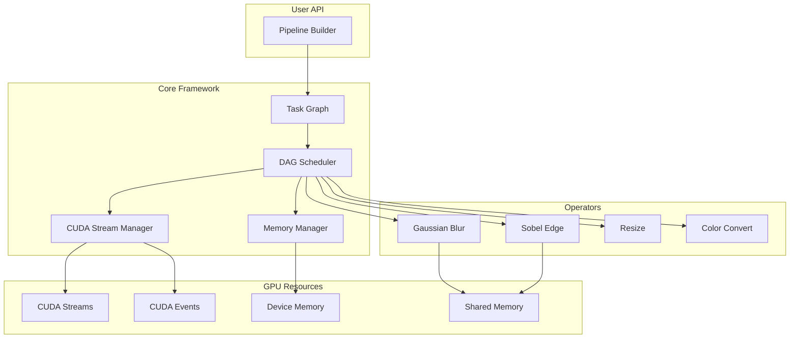

# Design Document: Mini-ImagePipe

## Overview

Mini-ImagePipe is a GPU-accelerated image processing pipeline framework built on a task graph (DAG) architecture. The system enables high-throughput video stream processing by leveraging CUDA streams for concurrent execution, pinned memory for optimized data transfer, and shared memory for efficient kernel operations.

The framework consists of four main subsystems:
1. **Operator Library** - GPU-accelerated image processing operators (Gaussian Blur, Sobel, Resize, Color Conversion)
2. **Task Graph Scheduler** - DAG-based task dependency management and execution orchestration
3. **CUDA Stream Manager** - Multi-stream concurrent execution with event-based synchronization
4. **Memory Manager** - Pinned memory pool for optimized host-device transfers

## Architecture



## Components and Interfaces

### 1. Operator Base Interface

```cpp
// Abstract base class for all image operators
class IOperator {
public:
    virtual ~IOperator() = default;
    
    // Execute operator on GPU stream
    virtual cudaError_t execute(
        const void* input,
        void* output,
        int width,
        int height,
        int channels,
        cudaStream_t stream
    ) = 0;
    
    // Get output dimensions given input dimensions
    virtual void getOutputDimensions(
        int inputWidth, int inputHeight,
        int& outputWidth, int& outputHeight
    ) const = 0;
    
    // Get operator name for debugging
    virtual const char* getName() const = 0;
};
```

### 2. Gaussian Blur Operator

```cpp
class GaussianBlurOperator : public IOperator {
public:
    enum KernelSize { KERNEL_3x3 = 3, KERNEL_5x5 = 5, KERNEL_7x7 = 7 };
    
    GaussianBlurOperator(KernelSize size, float sigma = 0.0f);
    
    cudaError_t execute(
        const void* input, void* output,
        int width, int height, int channels,
        cudaStream_t stream
    ) override;
    
private:
    KernelSize kernelSize_;
    float sigma_;
    float* d_kernelH_;  // Horizontal 1D kernel on device
    float* d_kernelV_;  // Vertical 1D kernel on device
    void* d_intermediate_;  // Intermediate buffer for separable filter
};
```

**Separable Filter Implementation:**
- Decompose 2D Gaussian kernel into two 1D kernels: G(x,y) = G(x) * G(y)
- First pass: horizontal convolution with 1D kernel
- Second pass: vertical convolution with 1D kernel
- Complexity reduction: O(n²) → O(2n) per pixel

**Shared Memory with Halo Regions:**
```
+------------------+
|  Halo (top)      |
+--+------------+--+
|H |   Tile     | H|
|a |   Data     | a|
|l |            | l|
|o |            | o|
+--+------------+--+
|  Halo (bottom)   |
+------------------+
```

### 3. Sobel Edge Detection Operator

```cpp
class SobelOperator : public IOperator {
public:
    SobelOperator();
    
    cudaError_t execute(
        const void* input, void* output,
        int width, int height, int channels,
        cudaStream_t stream
    ) override;
    
private:
    // Sobel kernels are constant, stored in constant memory
    // Gx = [-1 0 1; -2 0 2; -1 0 1]
    // Gy = [-1 -2 -1; 0 0 0; 1 2 1]
};
```

### 4. Resize Operator

```cpp
class ResizeOperator : public IOperator {
public:
    enum InterpolationMode { NEAREST, BILINEAR };
    
    ResizeOperator(int targetWidth, int targetHeight, InterpolationMode mode);
    
    cudaError_t execute(
        const void* input, void* output,
        int width, int height, int channels,
        cudaStream_t stream
    ) override;
    
    void getOutputDimensions(
        int inputWidth, int inputHeight,
        int& outputWidth, int& outputHeight
    ) const override;
    
private:
    int targetWidth_;
    int targetHeight_;
    InterpolationMode mode_;
};
```

**Coordinate Mapping:**
```
src_x = dst_x * (src_width / dst_width)
src_y = dst_y * (src_height / dst_height)
```

### 5. Color Conversion Operator

```cpp
class ColorConvertOperator : public IOperator {
public:
    enum ConversionType { RGB_TO_GRAY, BGR_TO_RGB, RGBA_TO_RGB };
    
    ColorConvertOperator(ConversionType type);
    
    cudaError_t execute(
        const void* input, void* output,
        int width, int height, int channels,
        cudaStream_t stream
    ) override;
    
private:
    ConversionType type_;
    // Luminance weights: Y = 0.299*R + 0.587*G + 0.114*B
    static constexpr float kLumR = 0.299f;
    static constexpr float kLumG = 0.587f;
    static constexpr float kLumB = 0.114f;
};
```

### 6. Task Graph and Node

```cpp
// Represents a single task in the DAG
struct TaskNode {
    int id;
    std::string name;
    std::shared_ptr<IOperator> op;
    std::vector<int> dependencies;  // IDs of upstream tasks
    std::vector<int> dependents;    // IDs of downstream tasks
    
    enum State { PENDING, READY, RUNNING, COMPLETED, FAILED };
    std::atomic<State> state;
    
    void* inputBuffer;
    void* outputBuffer;
    int width, height, channels;
};

class TaskGraph {
public:
    // Add a task node, returns task ID
    int addTask(const std::string& name, std::shared_ptr<IOperator> op);
    
    // Add dependency: 'from' must complete before 'to' starts
    bool addDependency(int from, int to);
    
    // Validate graph has no cycles
    bool validate() const;
    
    // Get topologically sorted execution order
    std::vector<int> getTopologicalOrder() const;
    
    // Get tasks with no pending dependencies
    std::vector<int> getReadyTasks() const;
    
private:
    std::vector<TaskNode> nodes_;
    bool hasCycle() const;  // DFS-based cycle detection
};
```

### 7. DAG Scheduler

```cpp
class DAGScheduler {
public:
    DAGScheduler(int numStreams = 4);
    ~DAGScheduler();
    
    // Execute the task graph
    cudaError_t execute(TaskGraph& graph);
    
    // Set error callback
    void setErrorCallback(std::function<void(int taskId, cudaError_t)> cb);
    
private:
    int numStreams_;
    std::vector<cudaStream_t> streams_;
    std::vector<cudaEvent_t> events_;
    
    // Assign stream to task based on dependencies
    int assignStream(const TaskNode& task, const TaskGraph& graph);
    
    // Insert synchronization between streams
    void insertSynchronization(int fromTask, int toTask);
};
```

### 8. Memory Manager

```cpp
class MemoryManager {
public:
    static MemoryManager& getInstance();
    
    // Allocate pinned host memory
    void* allocatePinned(size_t size);
    
    // Free pinned memory
    void freePinned(void* ptr);
    
    // Allocate device memory
    void* allocateDevice(size_t size);
    
    // Free device memory
    void freeDevice(void* ptr);
    
    // Async copy host to device
    cudaError_t copyToDeviceAsync(
        void* dst, const void* src, size_t size, cudaStream_t stream
    );
    
    // Async copy device to host
    cudaError_t copyToHostAsync(
        void* dst, const void* src, size_t size, cudaStream_t stream
    );
    
    // Release all resources
    void shutdown();
    
private:
    MemoryManager();
    ~MemoryManager();
    
    struct MemoryPool {
        std::vector<std::pair<void*, size_t>> freeBlocks;
        std::mutex mutex;
    };
    
    MemoryPool pinnedPool_;
    MemoryPool devicePool_;
    bool usePinnedMemory_;  // Falls back to pageable if allocation fails
};
```

### 9. Pipeline Builder

```cpp
class Pipeline {
public:
    Pipeline();
    
    // Add operator to pipeline, returns node ID
    int addOperator(const std::string& name, std::shared_ptr<IOperator> op);
    
    // Connect operators: output of 'from' feeds into 'to'
    void connect(int from, int to);
    
    // Set input source
    void setInput(int nodeId, void* data, int width, int height, int channels);
    
    // Get output from a node
    void* getOutput(int nodeId);
    
    // Execute pipeline
    cudaError_t execute();
    
    // Execute batch of frames
    cudaError_t executeBatch(
        const std::vector<void*>& inputs,
        std::vector<void*>& outputs,
        int width, int height, int channels
    );
    
    // Update operator parameters at runtime
    template<typename T>
    void setParameter(int nodeId, const std::string& param, T value);
    
private:
    TaskGraph graph_;
    DAGScheduler scheduler_;
    MemoryManager& memMgr_;
    
    std::unordered_map<int, void*> intermediateBuffers_;
    void allocateIntermediateBuffers();
};
```

## Data Models

### Image Buffer

```cpp
struct ImageBuffer {
    void* data;           // Pointer to pixel data
    int width;            // Image width in pixels
    int height;           // Image height in pixels
    int channels;         // Number of channels (1, 3, or 4)
    int stride;           // Row stride in bytes
    bool isDeviceMemory;  // True if data is on GPU
    bool isPinned;        // True if host memory is pinned
    
    size_t sizeInBytes() const {
        return static_cast<size_t>(stride) * height;
    }
};
```

### Kernel Configuration

```cpp
struct KernelConfig {
    dim3 blockSize;   // Thread block dimensions
    dim3 gridSize;    // Grid dimensions
    size_t sharedMem; // Shared memory size in bytes
    
    static KernelConfig forImage(int width, int height, int tileSize = 16) {
        KernelConfig cfg;
        cfg.blockSize = dim3(tileSize, tileSize);
        cfg.gridSize = dim3(
            (width + tileSize - 1) / tileSize,
            (height + tileSize - 1) / tileSize
        );
        return cfg;
    }
};
```

### Pipeline Configuration

```cpp
struct PipelineConfig {
    int numStreams = 4;           // Number of CUDA streams
    size_t pinnedPoolSize = 64 * 1024 * 1024;  // 64MB pinned memory pool
    bool enableProfiling = false; // Enable CUDA profiling
    int maxBatchSize = 8;         // Maximum frames in batch
};
```


## Correctness Properties

*A property is a characteristic or behavior that should hold true across all valid executions of a system—essentially, a formal statement about what the system should do. Properties serve as the bridge between human-readable specifications and machine-verifiable correctness guarantees.*

### Operator Properties

**Property 1: Gaussian Blur Multi-Channel Support**
*For any* valid image with 1, 3, or 4 channels and *for any* kernel size (3x3, 5x5, 7x7), applying Gaussian blur SHALL produce an output image with the same dimensions and channel count as the input.
**Validates: Requirements 1.1, 1.5**

**Property 2: Separable Filter Equivalence**
*For any* valid image and Gaussian kernel, the separable filter implementation (two 1D passes) SHALL produce results equivalent to direct 2D convolution within floating-point tolerance (epsilon < 1e-5).
**Validates: Requirements 1.2**

**Property 3: Reflection Padding Boundary Handling**
*For any* valid image, applying Gaussian blur SHALL produce valid pixel values at all boundary positions (no NaN, no out-of-range values), and boundary pixels SHALL reflect the expected reflection padding behavior.
**Validates: Requirements 1.4**

**Property 4: Sobel Gradient Computation**
*For any* image with a known edge pattern, the Sobel operator SHALL compute gradient magnitude as sqrt(Gx² + Gy²) where Gx and Gy are computed using standard 3x3 Sobel kernels.
**Validates: Requirements 2.1, 2.2**

**Property 5: Sobel Single-Channel Output**
*For any* input image regardless of channel count, the Sobel operator SHALL produce a single-channel output image with the same width and height as the input.
**Validates: Requirements 2.4**

**Property 6: Resize Coordinate Mapping**
*For any* resize operation with bilinear or nearest-neighbor interpolation, output pixel at (dst_x, dst_y) SHALL be computed from input coordinates (src_x, src_y) where src_x = dst_x * (src_width / dst_width) and src_y = dst_y * (src_height / dst_height).
**Validates: Requirements 3.1, 3.2, 3.3**

**Property 7: Resize Arbitrary Scale Factors**
*For any* scale factor s > 0 (both upscaling s > 1 and downscaling s < 1), the resize operator SHALL produce an output image with dimensions (input_width * s, input_height * s) rounded to integers.
**Validates: Requirements 3.4**

**Property 8: RGB to Grayscale Formula**
*For any* RGB pixel (R, G, B), the grayscale conversion SHALL produce Y = 0.299*R + 0.587*G + 0.114*B within floating-point tolerance.
**Validates: Requirements 4.2**

**Property 9: BGR to RGB Channel Swap**
*For any* BGR image, converting to RGB SHALL swap the first and third channels such that output[0] = input[2] and output[2] = input[0], with the middle channel unchanged.
**Validates: Requirements 4.3**

**Property 10: Alpha Channel Preservation**
*For any* RGBA image undergoing color conversion, the alpha channel value SHALL be preserved unchanged in the output.
**Validates: Requirements 4.4**

### Scheduler Properties

**Property 11: DAG Cycle Detection**
*For any* task graph, adding an edge that would create a cycle SHALL be rejected, and the graph SHALL remain in a valid acyclic state.
**Validates: Requirements 5.1**

**Property 12: Dependency Ordering**
*For any* valid task graph execution, *for all* tasks T with dependencies D1, D2, ..., Dn, task T SHALL only begin execution after ALL of D1, D2, ..., Dn have completed.
**Validates: Requirements 5.2, 5.4, 5.6**

**Property 13: Error Propagation**
*For any* task graph where task T fails, *all* tasks that depend (directly or transitively) on T SHALL NOT execute, and the error SHALL be propagated to the caller.
**Validates: Requirements 5.5**

**Property 14: Stream Assignment and Synchronization**
*For any* pair of independent tasks (no dependency path between them), they SHALL be assignable to different CUDA streams. *For any* dependent tasks in different streams, proper CUDA event synchronization SHALL be inserted.
**Validates: Requirements 6.1, 6.2**

**Property 15: Stream Synchronization on Completion**
*For any* pipeline execution, after execute() returns, *all* output buffers SHALL contain valid, fully computed results (no partial writes, no race conditions).
**Validates: Requirements 6.5**

### Memory Properties

**Property 16: Pinned Memory Async Transfer**
*For any* data transfer using the Memory Manager, the transfer SHALL complete correctly and the destination buffer SHALL contain an exact copy of the source data.
**Validates: Requirements 7.1, 7.2**

**Property 17: Memory Pool Reuse**
*For any* sequence of allocate-free-allocate operations of the same size, the memory pool SHALL reuse previously freed blocks, and the total number of cudaHostAlloc calls SHALL be less than the number of allocate requests.
**Validates: Requirements 7.4**

**Property 18: Memory Cleanup**
*For any* pipeline lifecycle (create, execute, shutdown), after shutdown() is called, *all* pinned memory allocations SHALL be freed (no memory leaks).
**Validates: Requirements 7.5**

### Pipeline Properties

**Property 19: Pipeline Topology and Buffer Management**
*For any* valid pipeline topology (sequential or parallel branches), the pipeline SHALL automatically allocate intermediate buffers of correct size for all connections.
**Validates: Requirements 8.1, 8.2**

**Property 20: No Redundant Computation**
*For any* task node with multiple downstream dependents, the task SHALL execute exactly once, and all dependents SHALL receive the same output buffer reference.
**Validates: Requirements 8.3**

**Property 21: Runtime Parameter Configuration**
*For any* operator parameter change at runtime, the next pipeline execution SHALL use the updated parameter value without requiring graph reconstruction.
**Validates: Requirements 8.4**

**Property 22: Batch Processing**
*For any* batch of N frames, the pipeline SHALL process all N frames and produce N corresponding output frames with correct results.
**Validates: Requirements 8.5**

## Error Handling

### Operator Errors

| Error Condition | Handling Strategy |
|-----------------|-------------------|
| Invalid input dimensions (width/height ≤ 0) | Return `cudaErrorInvalidValue`, log error |
| Unsupported channel count | Return `cudaErrorInvalidValue`, log error |
| CUDA kernel launch failure | Return CUDA error code, log kernel name and parameters |
| Device memory allocation failure | Return `cudaErrorMemoryAllocation`, attempt cleanup |

### Scheduler Errors

| Error Condition | Handling Strategy |
|-----------------|-------------------|
| Cycle detected in DAG | Reject edge addition, return false, log cycle path |
| Task execution failure | Mark task as FAILED, propagate to dependents, invoke error callback |
| Stream creation failure | Fall back to fewer streams, log warning |
| Event synchronization failure | Return CUDA error, halt execution |

### Memory Manager Errors

| Error Condition | Handling Strategy |
|-----------------|-------------------|
| Pinned memory allocation failure | Fall back to pageable memory, log warning |
| Device memory allocation failure | Return nullptr, log error with requested size |
| Invalid free (double free, invalid pointer) | Log error, ignore operation |
| Async copy failure | Return CUDA error code, do not retry |

### Pipeline Errors

| Error Condition | Handling Strategy |
|-----------------|-------------------|
| Invalid operator connection | Reject connection, return error |
| Buffer size mismatch | Reallocate buffer, log warning |
| Batch size exceeds maximum | Process in chunks, log info |

## Testing Strategy

### Unit Tests

Unit tests verify specific examples and edge cases:

1. **Operator Unit Tests**
   - Test each operator with known input/output pairs
   - Test boundary conditions (1x1 image, maximum size image)
   - Test error conditions (invalid parameters)

2. **Scheduler Unit Tests**
   - Test simple DAG topologies (linear, diamond, fork-join)
   - Test cycle detection with specific cycle patterns
   - Test error propagation with injected failures

3. **Memory Manager Unit Tests**
   - Test allocation/free sequences
   - Test pool behavior with specific allocation patterns
   - Test fallback behavior when pinned allocation fails

### Property-Based Tests

Property-based tests verify universal properties across randomly generated inputs. Each property test runs minimum 100 iterations.

**Testing Framework:** Google Test with custom property-based testing utilities for CUDA

**Property Test Configuration:**
```cpp
// Each property test runs 100+ iterations with random inputs
constexpr int kPropertyTestIterations = 100;

// Random image generator
ImageBuffer generateRandomImage(int minSize, int maxSize, int channels);

// Random DAG generator
TaskGraph generateRandomDAG(int minNodes, int maxNodes, float edgeProbability);
```

**Property Test Annotations:**
Each property test must be annotated with:
```cpp
// Feature: mini-image-pipe, Property N: [Property Title]
// Validates: Requirements X.Y
TEST(OperatorPropertyTest, GaussianBlurMultiChannel) {
    // Property 1: Gaussian Blur Multi-Channel Support
    // ...
}
```

### Integration Tests

1. **End-to-End Pipeline Tests**
   - Test complete pipelines with multiple operators
   - Verify output correctness against reference implementation

2. **Concurrency Tests**
   - Test multi-stream execution with varying stream counts
   - Verify no race conditions or data corruption

3. **Performance Benchmarks**
   - Measure throughput for standard image sizes
   - Compare separable vs direct convolution performance
